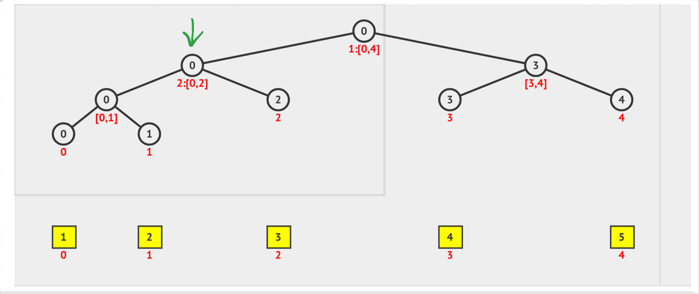
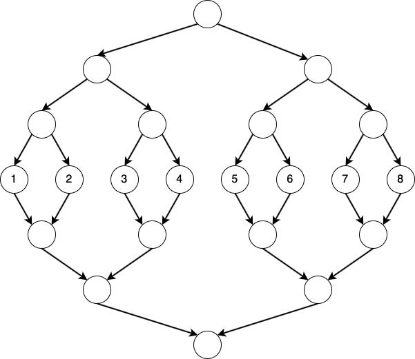

<!-- ## Summary

Xin chào các bạn. Để khởi đầu chuỗi bài viết về các thuật toán "độc lạ bình dương". Tuần này, chúng ta cùng nhau tìm hiểu về một sự kết hợp tưởng chừng như chẳng liên quan gì đến nhau giữa **Đồ thị** và **Segment Tree**.

Tuy nhiên, sự kết hợp này lại mạng đến cho chúng ta một hướng giải quyết mới khá thú vị cho một số bài toán mà mình đã gặp trong một cuộc thi lập trình.

Hãy cùng mình tìm hiểu về bài toán này nhé! Sau đó cùng nhau "cook" một bài trong đề thi HSG Quốc Gia môn Tin học năm 2023 có sử dụng thuật toán này nhé!

(Vẫn đang viết Comming soon ....)  -->

<!-- ## Bài toán cơ sở

- Hãy cùng nhau xem xét bài toán sau: [Legacy](https://codeforces.com/contest/787/problem/D)
- Đề bài: Cho một đồ thị có hướng $n$ đỉnh. Cho $q$ truy vấn, mỗi truy vấn có dạng:
  - `1 v u w`: thêm cạnh từ $v$ đến $u$ với trọng số $w$.
  - `2 v l r w`: Nối đỉnh v với tất cả các đỉnh trong đoạn $[l, r]$ với trọng số $w$.
  - `3 l r v w`: Nối tất cả các đỉnh trong đoạn $[l, r]$ với đỉnh $v$ với trọng số $w$.
Sau $q$ truy vấn, hãy in ra đường đi ngắn nhất từ đỉnh $1$ đến các đỉnh còn lại trong đồ thị.

- Giới hạn: $1 \leq n, q \leq 10^5$.

## Lời giải

- Đọc qua bài toán trên, ta thấy rằng yêu cầu tìm đường đi ngắn nhất là không khó. Bên cạnh đó, yêu cầu nối đỉnh của truy vấn loại $1$ cũng không phải vấn đề.

- Tuy nhiên, với các truy vấn loại $2$ và $3$, ta thấy rằng việc nối đỉnh trong đoạn $[l, r]$ là một vấn đề không hề đơn giản. 
Nếu nối cạnh 1 cách thủ công, độ phức tạp sẽ rất lớn.

- Có một dấu hiệu rằng cả truy vấn $2$ và $3$ đều có liên quan đến 1 đoạn liên tiếp. Lúc này, ta có thể suy nghĩ đến việc sử dụng **Segment Tree**. Thử hình dung cấu trúc của cây Segment Tree như hình vẽ sau:

- Nhìn vào hình, ta có ý tưởng rằng, giả sử nối đỉnh $u$ với tất cả đỉnh trong đoạn $[1, 3]$ thì thay vì nối từng đỉnh trong đoạn $[1, 3]$ với $u$, ta có thể nối đỉnh $u$ với đỉnh một đỉnh duy nhất là đỉnh có mũi tên màu xanh lá như kia.

- Về phía trọng số, đỉnh xanh lá là đỉnh ảo, vì vậy khi nối xuống các đỉnh ảo khác sẽ có trọng số là $0$. 

- Tương tự với truy vấn $3$, ta cũng sẽ dựng 1 cây segment tree khác. 

- Đây là hình vẽ dụ cho trường hợp 8 đỉnh -->