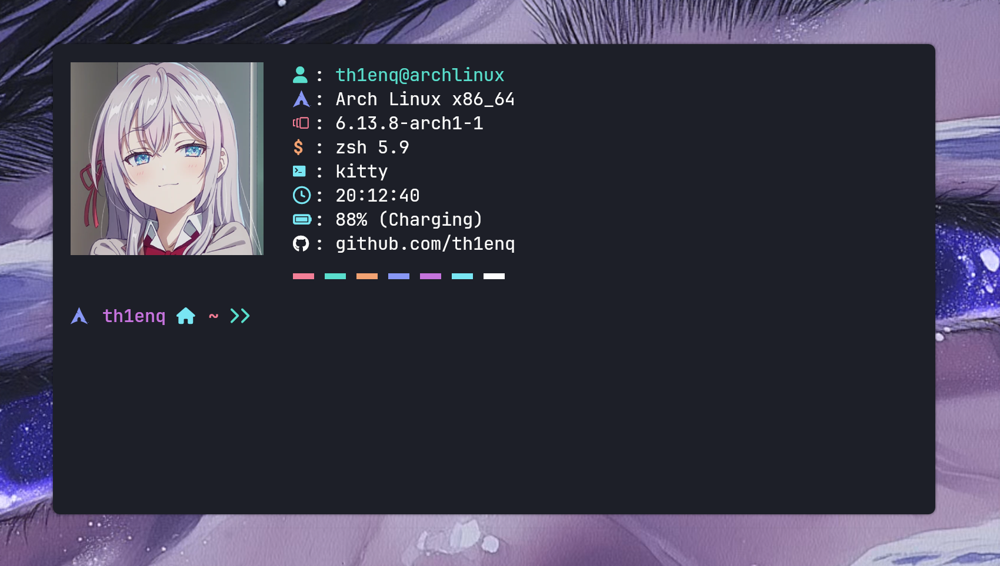
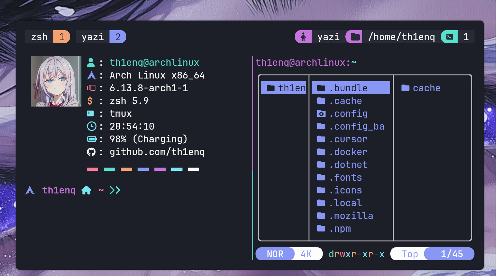
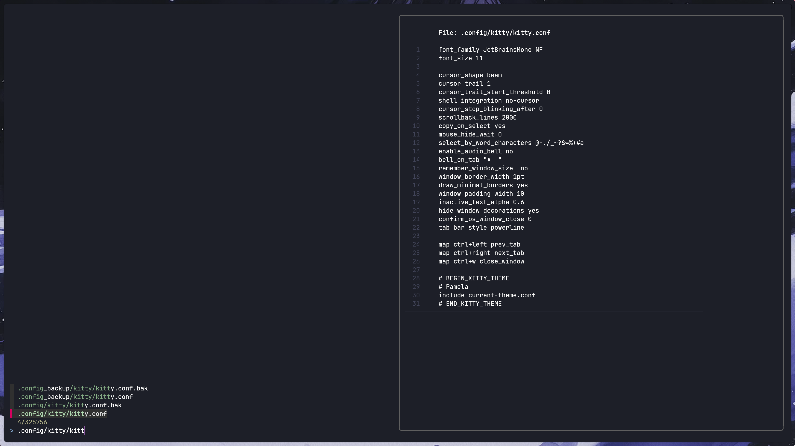
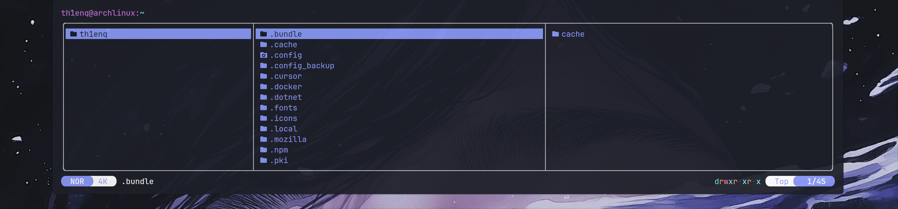

## Summary

Linux là một hệ điều hành mã nguồn mở rất phổ biến với các developer. 

Khi sử dụng Linux, hầu hết thời gian chúng ta sẽ tương tác với hệ điều hành thông qua terminal.
Vì vậy, việc cấu hình terminal sao cho phù hợp với nhu cầu sử dụng là rất quan trọng.

Trong bài viết này, mình sẽ chia sẻ một số cấu hình terminal mà mình đang sử dụng. Ngoài giúp tiện lợi hơn trong quá trình làm việc mà còn để tạo phong cách riêng cho terminal của mình. Để có thể làm nó trông như thế này:



*Tất cả file config của mình đều sẽ được upload lên github. Các bạn có thể tham khảo và clone về để sử dụng nhé!*

[Github.com/th1enq/Terminal - Config](https://github.com/th1enq/dotfiles_v2)

## Install

Việc cài đặt và config đều khá tương tự nhau trên các distro khác nhau. Ở đây mình đang sử dụng `Arch Linux`. Nhưng đối với các bạn sử dụng `Ubuntu` hay các distro khác, các bạn có thể tham khảo cách cài đặt và cấu hình tương tự nhé.

### Kitty

Đầu tiên, ta sẽ tiến hành cài đặt một terminal emulator đảm bảo các tiêu chí nhanh, gọn, nhẹ và dễ dàng config. Ở đây, mình sử dụng [kitty](https://github.com/kovidgoyal/kitty).

Để cài đặt `kitty`, đối với `Arch Linux`, bạn có thể sử dụng `pacman`:
```bash
sudo pacman -S kitty
```
Hoặc nếu bạn sử dụng `Ubuntu`, bạn có thể sử dụng `apt`:
```bash
sudo apt install kitty
```

Sau khi cài đặt xong, bạn có thể mở terminal lên và gõ lệnh sau để kiểm tra xem đã cài đặt thành công chưa:
```bash
kitty --version
```
Nếu bạn thấy phiên bản của `kitty` được hiển thị, có nghĩa là bạn đã cài đặt thành công.

### Zsh
Tiếp theo, ta sẽ cài đặt `zsh`, một shell rất phổ biến và mạnh mẽ. `zsh` có nhiều tính năng hữu ích như tự động hoàn thành, hỗ trợ plugin và theme, giúp tăng năng suất làm việc của bạn.
Để cài đặt `zsh`, bạn có thể sử dụng `pacman` hoặc `apt` tương tự như trên:

```bash
sudo pacman -S zsh
```
Hoặc
```bash
sudo apt install zsh
```
Sau khi cài đặt xong, bạn có thể kiểm tra xem đã cài đặt thành công chưa bằng cách gõ lệnh sau:
```bash
zsh --version
```
Nếu bạn thấy phiên bản của `zsh` được hiển thị, có nghĩa là bạn đã cài đặt thành công.

## Config

Chúng ta sẽ chỉ cần cài đặt một số thứ trên. Ngoài ra, trong quá trình config ta sẽ cài thêm một số thứ nhỏ nhỏ khác nữa.

### Kitty

Đầu tiên, để config kitty, hãy tạo một file cấu hình mới bằng cách sử dụng lệnh sau:
```bash
touch ~/.config/kitty/kitty.conf
```
Sau đó, bạn có thể mở file này và thêm các cấu hình mà bạn muốn. Tất tần tật các cấu hình mà bạn có thể setup đều có thể tìm thấy trong [Kitty Docs](https://sw.kovidgoyal.net/kitty/conf.html).

Mình sẽ chỉ đưa ra một số gợi ý cấu hình mà mình đang sử dụng trong file `kitty.conf` của mình. Bạn có thể tham khảo và tùy chỉnh theo ý thích của mình nhé. 

```conf
include current-theme.conf # Sử dụng theme màu
font_family JetBrainsMono NF # Font chữ
font_size 11 # Kích thước font chữ
 
cursor_shape beam # Hình dạng con trỏ
cursor_trail 1 # Bật chế độ trail
cursor_trail_start_threshold 0 # Thời gian bắt đầu trail

...

map ctrl+left prev_tab # Chuyển tab trái
map ctrl+right next_tab # Chuyển tab phải
map ctrl+w close_window # Đóng tab
```

### Zsh
Tiếp theo, để config `zsh`, hãy tạo một file cấu hình mới bằng cách sử dụng lệnh sau:
```bash
touch ~/.zshrc
```
Sau đó, bạn có thể mở file này và thêm các cấu hình mà bạn muốn. Tất tần tật các cấu hình mà bạn có thể setup đều có thể tìm thấy trong [Zsh Docs](https://zsh.sourceforge.io/Doc/Release/zsh_toc.html).

Ở đây có 3 plugin quan trọng mà mình nghĩ các bạn nên cài đặt đó là:
- `zsh-autosuggestions`: Tự động gợi ý lệnh khi bạn gõ.
- `zsh-syntax-highlighting`: Tô màu cú pháp cho lệnh.
- `zsh-history-substring-search`: Tìm kiếm lệnh trong lịch sử.

Để cài đặt các plugin này, bạn có thể sử dụng `git` để clone về thư mục `~/.oh-my-zsh/custom/plugins/` như sau:
```bash
git clone https://github.com/zsh-users/zsh-autosuggestions.git
git clone https://github.com/zsh-users/zsh-syntax-highlighting.git
git clone https://github.com/zsh-users/zsh-history-substring-search.git
```

Sau đó mở file `~/.zshrc` và thêm các plugin này vào:
```conf
source /pathto/zsh-autosuggestions/zsh-autosuggestions.zsh
source /pathto/zsh-syntax-highlighting/zsh-syntax-highlighting.zsh
source /pathto/zsh-history-substring-search/zsh-history-substring-search.zsh
```
Trong đó, `/pathto/` là đường dẫn đến thư mục chứa các plugin mà bạn đã clone về. Bạn có thể sử dụng lệnh `pwd` để lấy đường dẫn đến thư mục hiện tại.

Ngoài ra mình còn sử dụng thêm `fzf` để hỗ trợ tìm kiếm file nhanh hơn. Bạn có thể cài đặt `fzf` bằng cách sử dụng lệnh sau:
```bash
sudo pacman -S fzf
```
Hoặc
```bash
sudo apt install fzf
```

Có một tính năng rất hay của `zsh` đó là `alias`. Bạn có thể tạo các alias cho các lệnh mà bạn thường xuyên sử dụng để tiết kiệm thời gian gõ lệnh. Ví dụ:
```conf
alias f=fzf
alias fp='fzf --preview="bat --color=always {}"'
alias ga='git add'
alias gcm='git commit'
alias gp='git push'
alias gi='git init'
 ```

### Neofetch

Và cuối cùng, để hiển thị các thông tin một cách "wibu" như thế kia, mình có sử dụng `neofetch` - Một công cụ giúp hiển thị thông tin hệ thống và hoàn toàn có thể tùy chỉnh được. Để config `neofetch`, hãy làm tương tự như `kitty`, tạo một file cấu hình mới bằng cách sử dụng lệnh sau:
```bash
touch ~/.config/neofetch/config.conf
```
Tất cả các cấu hình mà bạn có thể setup cho `neofetch` đều có thể tìm thấy trong [Neofetch Docs](https://github.com/dylanaraps/neofetch/wiki/Configuration-Options).

## Conclusion 

Như vậy là các bạn đã config được 90% terminal của mình rồi đấy !!!. Tuy nhiên hãy ưu tiên sự tiện lời hơn là sự "wibu" nhé. XD. Dưới dây là một số hình ảnh về terminal của mình sau khi đã config xong.


Mở 2 hay nhiều tab trên cùng 1 terminal sử dụng Tmux


Tích hợp `fzf` để tìm kiếm cũng như hiển thị nội dung file


Tích hợp `yazi` để quản lý file, folder trên terminal


Còn một số trò như xem youtube trên terminal hay chơi game trên terminal nữa. Mình sẽ viết một bài khác để chia sẻ về những thứ này nhé.

Ngoài ra, có một cộng đồng rất lớn gồm những người thích config terminal. Họ thường chia sẻ những cấu hình của họ trên các trang mạng xã hội như Reddit, Twitter, Github,... Bạn có thể tham khảo và học hỏi từ họ để tạo ra một terminal đẹp và tiện lợi cho riêng mình tại đây [Reddit - Unixporn](https://www.reddit.com/r/unixporn/). 

[Github.com/th1enq/Terminal - Config](https://github.com/th1enq/dotfiles_v2)

Và đây là toàn bộ cấu hình của mình. Các bạn có thể tham khảo và clone về để sử dụng nhé!

Tạm biệt và chúc các bạn *Ricing* vui vẻ xD. 


